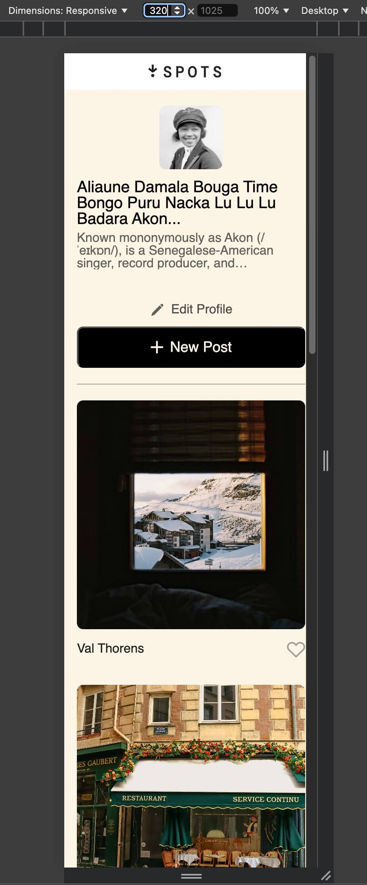
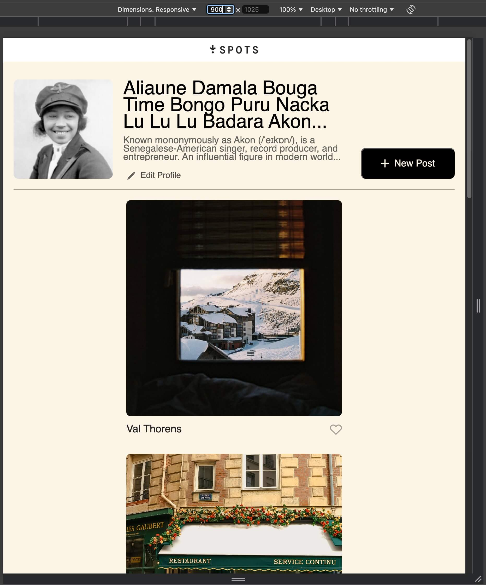
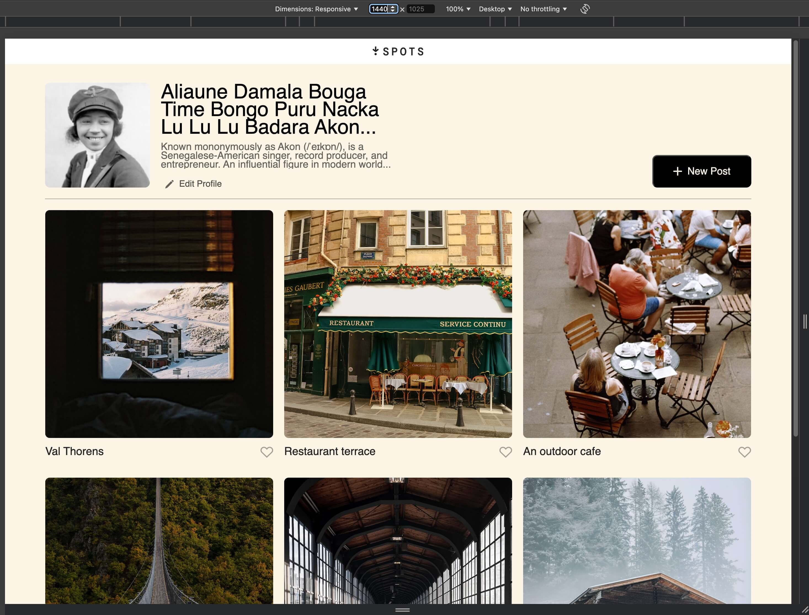

# Project 3: Spots

### Overview

- Intro
- Figma
- Tech used
- Description and functionality
- Github link
- Images

**Intro**

Spots is a project displaying the power of the css. All the elements displayed correctly on popular screen sizes using css grid and very minimal media queries. Enjoy.

**Figma**

- [Link to the project on Figma](https://www.figma.com/file/BBNm2bC3lj8QQMHlnqRsga/Sprint-3-Project-%E2%80%94-Spots?type=design&node-id=2%3A60&mode=design&t=afgNFybdorZO6cQo-1)

**Tech used**

This project was fun and challenging. I used minimal media queries as mostly the responsive design is made with css display grid. Using too many media requests negatively impacts loading and performance. Bandwith, server strain, mobile performance are all taken into account when designing the app.

**Description and Functionality**
Spots is a site that allows you to add pictures of places you have visited. You can upload your photo, bio and description of yourself. The site is designed to function on any browser- mobile or desktop. No need to install special extensions. Plans to improve the project includes archiving photos feature, adding location maps of where the photo was taken, and a section for you to write a narrative of the photo along with the title.

**Github link**
https://jcalcan.github.io/se_project_spots/

**Images and screenshots**
Photo showcase of the design of the site in different dimensions for various devices. For example,
for mobile devices it would look like this - . For tablets like this  and regular desktops like this . The design and code were made with responsive and intuitive to users devices in mind. Easy to use, read and navigate were top priority elevating the users experience with the app.

**Video Explanation of the project**
In this comprehensive video presentation, I showcase the responsive social media app project named 'Spots'. I walk through key aspects of the project, including its overview, layout and responsiveness, use of semantic HTML, implementation of the BEM methodology, CSS structure, and personal challenges and learnings. I explain the project's intuitive design, use of CSS Grid for layout, responsive design techniques, semantic HTML implementation, and the BEM approach to the project. I also discuss my problem-solving process and the valuable skills gained throughout the project's development. This video provides insights into modern web development practices and my growth journey. Enjoy.
[Link to the project on Youtube](https://youtu.be/umIkuP_4rf4)

Good luck and have fun!
